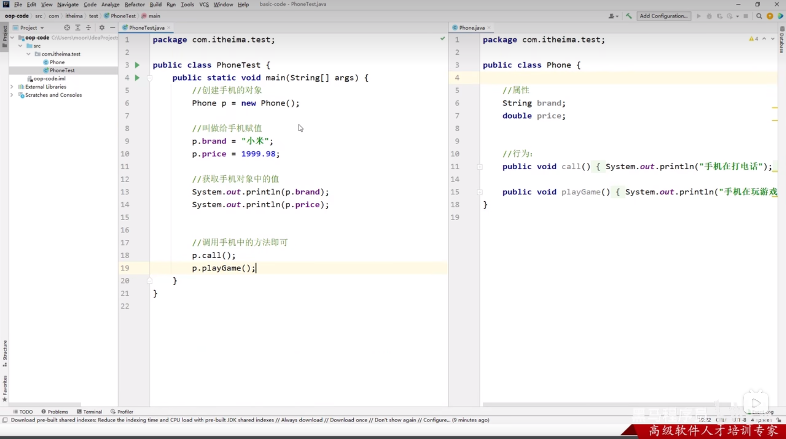
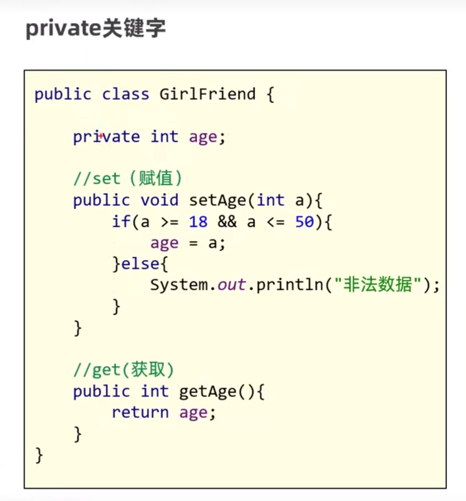
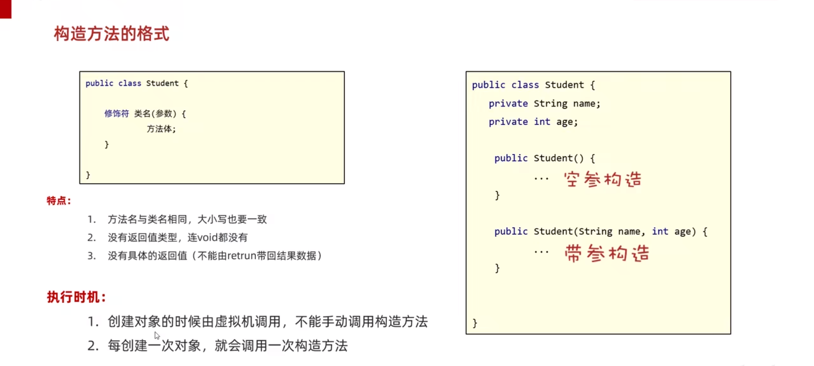
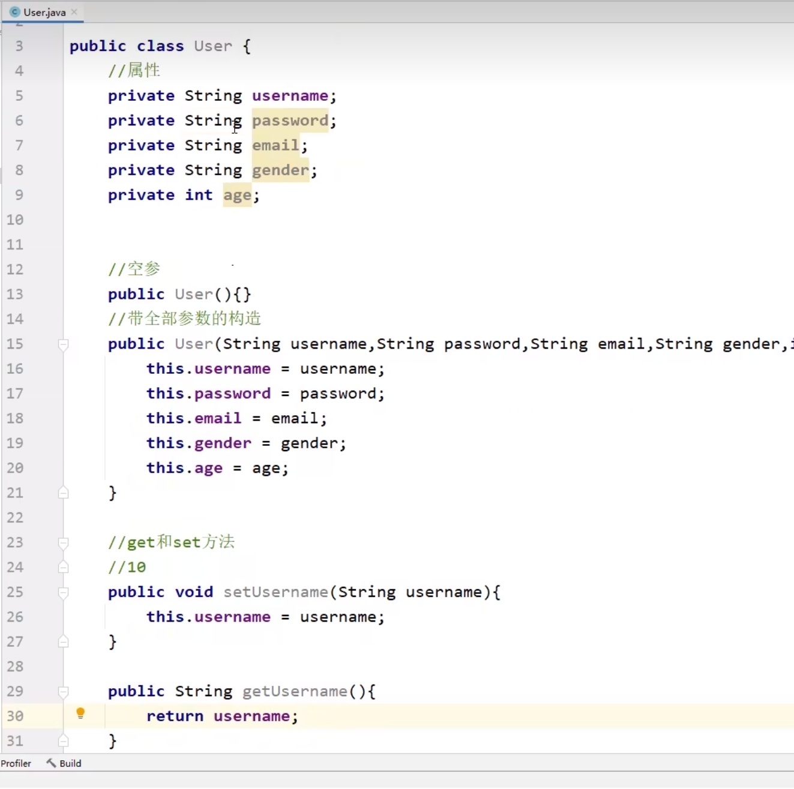

# 05.面向对象

## 2023.09.24

获取已有对象，如random,scanner

自己设计对象

#### 类和对象

类：是对象共同特征的描述

对象：是真实存在的具体东西

java中必须先设计类，才能获得对象

```
//定义类
public class 类名{
	成员变量（代表属性，一般是名词）
	成员方法（代表行为）
	构造器
	代码块
	内部类
}
```



调用：

```
对象名.成员方法（）
```

补充：用来描述一类事物的类，专业叫做Javabean类，不写main方法

​			编写main方法的类叫做测试类

成员变量

```
修饰符 数据类型 变量名称 = 初始化值；
```

类中不给初值，否则代表类的全部对象均为此值 。应对象中再给值


一个文件中可以定义多个类，但只有一个类是public修饰的，建议一个文件一个类

public修饰的类名必须是java代码的文件名称


#### 面向对象三大特征

封装 继承 多态

#### 封装

封装思想：**对象代表什么，就得封装对应的数据，并提供数据对应的行为**

如：人画圆：不是人画的圆，而是人调用了圆画圆的方法，

​		所以画圆这个方法应该在圆这个类里

再比如：String就是一个对象，string.length就是调用方法，这些方法都封装到一起

##### private关键字

权限修饰符，可以修饰成员变量和成员方法

被private修饰的成员只能在本类中才能访问



#### 就近原则和this关键字

在方法里面的变量为局部变量

在方法外面的变量为成员变量

局部变量与成员变量同时存在重名时，采用就近原则

如果就想用成员变量，使用this.成员变量

#### 构造方法

也叫构造器、构造函数。

如果没有定义构造方法，系统会默认给出一个无参的构造函数，自己定义则不会给出

创建对象的时候，虚拟机会自动调用构造方法

作用：**在创建对象时给成员变量进行赋值**

```
修饰符 类名（参数）{
		方法体；
}
```



构造方法的重载：带参和无参构造方法可以同时存在

推荐的使用方式：**无论是否使用，都书写无参构造方法和带全部参数的构造方法。**

#### 标准 JavaBean

1.类名见名知义

2.成员变量使用private修饰

3.至少提供两个构造方法 无参和全参

4.提供每一个成员变量对应的setXxx()/getXxx()



快捷键alt + insert

IDEA插件PTG自动生成