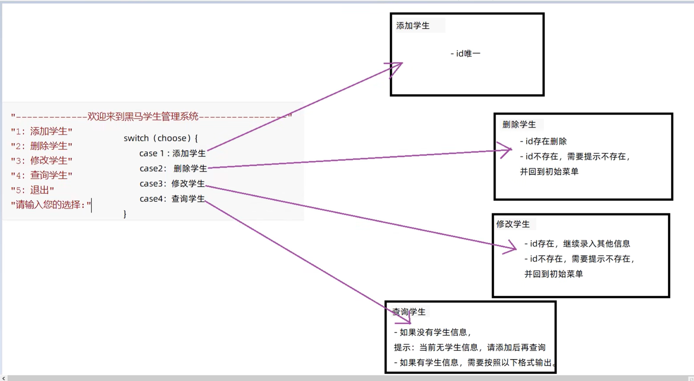

# 07.集合List

## 2023.09.27

#### 集合与数组的区别

**自动扩容**，即集合长度可变

数组可以存基本数据类型，也可以引用数据类型

集合只能存引用数据类型，存基本数据类型需要变成包装类


#### ArrayList类

泛型<E>，用来限定数据类型

```
ArrayList<String> list = new ArrayList<>();		//创建对象
```

##### 成员方法——增删改查

```
boolean add(E e)		//添加元素，返回值表示是否添加成功
boolean remove(E e)		//删除指定元素，返回值表示是否删除成功
E remove(int index)		//删除指定索引的元素，返回被删除元素
E set(int index,E e)	//修改指定索引下的元素，返回原来的元素
E get(int index)		//获取指定索引的元素
```

```
int size()				//集合的长度，也就是集合中元素的个数
```

##### 基本数据类型对于包装类

byte					Byte

short				  Short

char					Character

int 					  Integer

long					Long

float					Float

double				Double

boolean			  Boolean

```
ArrayList<Integer> list = new ArrayList<>();	//举例
```


#### 实战-控制台版学生信息管理系统

黑马P116



工程文件见../Projects/StudentSystem