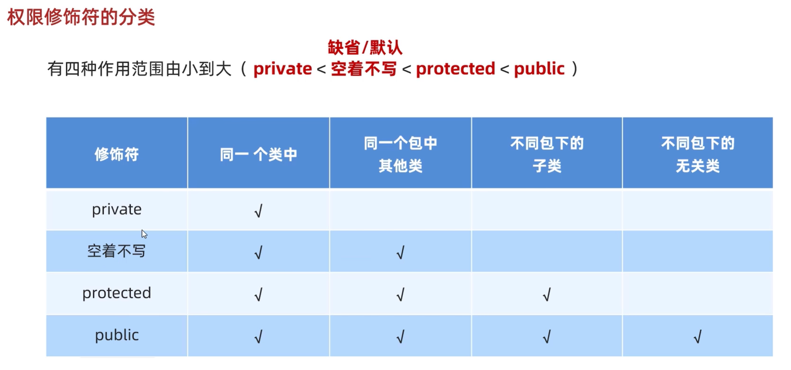
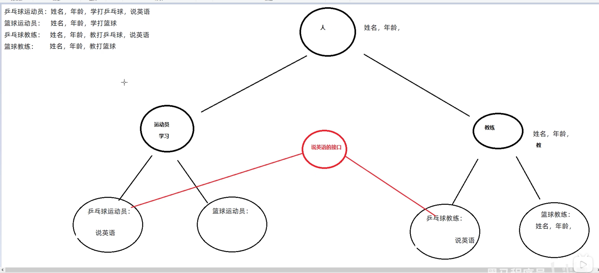

# 09.面向对象进阶2 - 多态、接口

## 2023.10.02 - 2023.10.03

### 多态

同类型的对象，表现出的不同形态

使用父类类型person作为参数，可以接收所以子类对象teacher,student,admin

##### 表现形式：

把子类对象赋值给父类类型

父类类型 对象名称 = 子类对象

##### 多态的前提

有继承/实现关系

有父类引用指向子类对象

```
Fu f = new Zi();	//利用多态创建对象
```

有方法重写


##### 多态调用成员的特点

**调用成员变量**，编译看左边，运行也看左边

编译时看的是左边的父类中有没有这个变量，有才编译成功

运行时实际获取的就是左边父类中成员变量的值

**调用成员方法**，编译看左边，运行看右边 ↓ 

编译时看的是左边的父类中有没有这个方法，有才编译成功

运行时实际运行的是子类中的方法

```
Fu f = new Zi();
//可以理解为：多态创建的是Fu类的对象f，所以默认会从Fu类里找
//子类成员变量会继承自父类，所以调用父类成员变量
//而成员方法中，如果子类对方法进行了重写，会在虚方法表中把父类方法覆盖
```


##### 多态的优势与劣势

优：在多态形式下，右边对象可以实现解耦合（方便换），便于扩展和维护

​		定义方法时，使用父类类型作为参数，可以接收所以子类对象，体现多态的扩展性

劣：不能调用子类的特有功能（多态基于继承，编译看左边，父类没有所以无法调用）

​		解决方案：变回子类类型就行了 Zi z = (Zi)f;    之后就能调用了

​							关键字instanceof 		if(z  instanceof Zi)	再转换类型


### 包

包就是文件夹，用来管理各种不同功能的java类，方便后期代码维护

命名规则：公司域名反写+包的作用 com.tencent.domain

import关键字

```
import com.tencent.domain.stduent;		//导包，把要用的
```

如果两个包中有同类名时，使用全类名com.tencent.domain.stduent()


### final

可以修饰方法，类，变量

final修饰的方法为最终方法，不能被重写

final修饰的类为最终类，不能被继承

final修饰的变量叫做常量，只能被赋值一次

#### 常量

常量一般作为系统的配置信息

单个单词：全部大写

多个单词：全部大写，单词之间用下划线隔开

final修饰的变量若为基本类型，数据值不能改变，若为引用类型，变量存储的地址值不能发生改变，对象内部的可以改变，如new出的对象内部的成员变量还是可以变的


### 权限修饰符

用来控制一个成员能够被访问的范围的

可以修饰：成员变量、方法、构造方法、内部类



一般只用private和public


### 代码块

{}中的叫代码块

局部代码块：写在方法里面的{ }，主要节约内存，已经基本不用了

构造代码块：写在成员位置的代码块，把多个构造方法中的重复代码抽取出来，

​					   先执行构造代码块再执行构造方法，现在也已经基本不用了

静态代码块：格式：static{代码块}

​					   特点：需要static修饰，随着类的加载而加载，并且自动触发，只执行一次

​					   使用场景：在类加载的时候，做一些**数据初始化**的时候使用


### 抽象类abstract

父类中有不能确定具体的方法体，所以定义为抽象的，子类用的时候再重写

抽象方法子类抽象方法必须重写（且按相同的格式）

抽象方法所在的类即为抽象类

#### 抽象方法

将共性的行为（方法）抽取到父类之后，由于每一个子类执行的内容是不一样的，所以在父类中**不能确定具体的方法体**，该定义就可以定义为抽象的

```
public abstract 返回值类型 方法名(参数);	//抽象方法定义格式
public abstract class 类名{};		   	 //抽象方法定义格式
```

抽象类不能实例化（创建对象）

抽象类中不一定有抽象方法，有抽象方法的类一定是抽象类

没有方法体（不知道方法体里写什么）的类一定是抽象类

抽象类可以有构造方法

抽象类的子类    要么重写抽象类的**所有抽象方法**，要么也是抽象类


### 接口interface

接口就是一种**规则** ，是对**行为**的抽象

不是类！！！新建时不选class选Interface

接口用关键字interface来定义

```
public interface 接口名{ }
```

接口不能实例化，即不能创建对象

接口和类之间是**实现**关系，通过implements关键字表示

```
public class 类名 implements 接口名{ }
```

接口的子类（实现类）：要么重写接口中的所有抽象方法，要么是抽象类


ps:

```
public class 类名 implements 接口名1,接口名2{ }		//接口和类也可以多实现
```

```
public class 类名 extends 父类 implements 接口名1,接口名2{ }	
//实现类可以继承一个类的同时实现多个接口
```


#### 接口中成员的特点

成员变量：只能是常量，默认修饰符为 public static final

构造方法：没有

成员方法：只能是抽象方法，默认修饰符为 public abstract  (JDK8以后有更新)


#### 接口和类之间的关系

类和类：继承，只能单继承，但可以多层继承

类和接口：实现关系，可以单实现/多实现，还可以继承一个类的同时实现多个接口

接口和接口：继承关系，可以单继承/多继承 ，

​					   如果有实现类实现类子接口，那么所有的抽象方法都需要重写




##### JDK8开始接口中新增的方法

JDK7以前：接口中只能定义抽象方法		//接口一旦变化，实现类中必须更改

JDK8新特性：接口中可以定义有方法体的方法（默认default、静态）

​						默认方法不是抽象方法，不强制重写，如果重写需要去掉default关键字

JDK9新特性：接口中可以定义私有方法，普通（静态）私有方法给默认（静态）方法服务 


##### 接口的应用

当一个方法的参数是接口时，可以传递接口所有实现类的对象，这种方式称之为接口多态


##### 适配器设计模式

解决接口与接口实现类之间的矛盾问题

：另外定义一个中间类 空实现 接口，实际的实现类不去实现接口，而是继承中间类，需要用到哪个方法就重写哪个方法就可以了。

这个中间类叫做适配器IneterAdapter


### 内部类

类的五大属性：属性、方法、构造方法、代码块、内部类

在一个类的里面，再定义一个类，叫做内部类

内部类表示的事物是外部类的一部分，内部类单独出现没有任何意义

```
public class car{
	String carName;
	int carAge;
	
	class Engine{		//内部类
	    String engineName;
	    int engineAge;
	    
	    public void show(){
	    	System.out.println(carName);
	    }
	}
}
```

内部类可以直接访问外部类的成员，包括私有成员；

外部类要访问内部类的成员必须创建对象


#### 成员内部类

不常用，如上面的engine即为成员内部类

获取成员内部类：直接创建对象

```
Outer.Inner oi = new Outer().new Inner();
```

或者外部类编写方法，对外提供内部类对象(private)

#### 静态内部类

不常用，成员内部类的一种，  如 static class Engine

静态内部类只能访问内部类中的静态变量和静态方法，如果想访问非静态的需要创建对象

```
Outer.Inner oi = new Outer().Inner();
```

调用直接 外部类名.内部类名.方法名();

#### 局部内部类

将内部类定义在方法里面就叫做局部内部类，类似于方法里面的局部变量

外界无法直接使用，需要在方法内部创建对象并使用

该类可以直接访问外部类的成员，也可以访问方法内的局部变量

#### 匿名内部类（重点掌握）

匿名内部类本质上就是隐藏了名字的内部类

应用场景：只使用一次，单独定义一个类太麻烦了  ->  匿名内部类

```
格式：
new 类名或接口名() {	//继承/实现
	重写方法;		 //方法重写
};				    //创建对象	
```

举例：

```
new Swim() {

	@Override
	public void swim(){
		System.out.println("重写了方法");
	}
};
//实现了Swim接口
//整个语句实际上是个新创建的实现了接口/继承了父类的对象
//真正的匿名内部类是{}包住的部分
//如果只使用一次，单独定义一个类太麻烦了,匿名内部类实际上是简化了流程
//调用时整个语句可以认为是一个对象而整体作为参数
```

