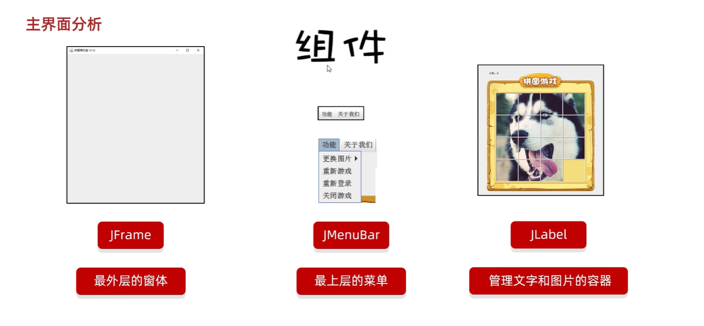

# 10.面向对象进阶实战-拼图游戏

## 2023.10.04

### 需求



### GUI - JAVA SWING

### 事件

事件源：按钮，图片，窗体

事件：某些操作，如鼠标单机，鼠标划入

绑定监听：当事件源上发生了某个事件，则执行某段代码

可以直接实现这些监听接口，再重写其中所有方法

KeyListener键盘监听

MouseListener鼠标监听

ActionListener动作监听 精简版，只单击和空格

```
JButton jtb = new JButton("按钮文字");
jtb.setBounds(0,0,100,50);
jtb.addActionListener(new MyActionListener){
	//只用一次，匿名内部类
	@Override
	public void actionPerformed(ActionEvent e){
		System.out.println("111");
	}
};
this.getContentPane(jtb);
```

e.getCode()