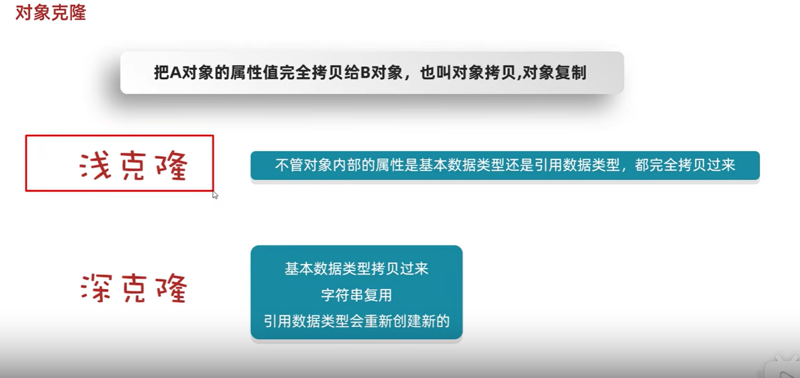

# 11.常用API

## 2023.10.10

### 均可查API帮助文档

### Math

Math.abs()	绝对值

Math.ceil()    进一

Math.floor()	去尾

Math.round()	四舍五入

Math.max(a,b)	最大值

Math.pow(a,b)	a的b次幂

Math.sqrt()		开方

Math.cbrt()		开三次方


### System

System.exit(0)		终止当前运行的Java虚拟机

System.currentTimeMillis()		返回当前系统的时间毫秒值形式（long）自时间原点之后

时间原点1970.1.1 08:00:00

System.arraycopy()		数组拷贝


### Runtime

Runtime表示当前虚拟机的运行环境

不是静态的，不能直接调用，要调用方法必须先获取到runtume的对象


不能new，要Runtime.getRuntime()获取对象


### Object

JAVA中的顶级父类

没有成员变量，所以只有一个无参构造

toString一般会重写，equals比较的是地址值，可以重写为比较对象属性值




object里的clone为浅克隆

需要重写Object的clone方法

实际用的是第三方的代码Gson，导入lib library

#### Objects工具类


### BigInteger

上限约为无限，但必须为整数

对象一旦创建，内部记录的值无法改变

#### 构造方法


只要进行了计算都会产生一个新的BigInteger对象

#### 成员方法


### BigDecimal

表示较大的小数以及解决小数运算精度失真问题。

需要精确运算时（小数）

```
BigDecimal bd = new BigDecimal("0.001");	//传小数不精确，传字符串才精确
```

通过静态方法

```
BigDecimal bd = new BigDecimal.valueof(double val);
```


### 正则表达式regex

可以查api文档

校验字符串是否满足一定的规则，或在一段文本中查找满足要求的内容

```
str.matches(正则表达式)
```

方括号 [] 表示一个范围，只匹配一个字符

因为\表示转义字符，所以实际写的时候要写成“\\\d”


```
[a-z]{6,}至少出现6次a-z
[a-z]{4}必须出现正好4次a-z
```

举例：手机号

```
"1[3-9]\\d{9}"
```


#### 爬虫

利用正则表达式


##### 有条件爬取

(（?i）java) (?=8|11|7) 		?i表示忽略大小写的java，后面的?表示占位符为前面的java，但是不截取8117

(（?i）java) (?:8|11|7)      :表示带8 11 7 

(（?i）java) (?!8|11|7)       !为后面不跟8 11 7


##### 贪婪爬取与非贪婪爬取

爬取“ab+”

贪婪爬取（默认）：尽可能地多爬取数据

非贪婪爬取：尽可能少地爬取


#### 正则表达式在字符串中的使用


#### 分组

分组就是一个小括号 ()

分组有组号，从1开始，以左括号为基准

##### 捕获分组（默认）

捕获分组就是吧这一组的数据捕获出来，再用一次

内部使用 \\\组号	  外部使用$组号

\\\组号       表示把这一组的内容再拿出来再用一次 -> 需求为某某部分“一致”时，就可以用


##### 非捕获分组


### 时间相关类

#### JDK7前

##### Date类

原子钟--世界标准时间（UTC） 中国+8

```
Date d = new Date(0L);		//时间原点过了0ms的时间对象
```

```
long time = sdf.getTime();		//获取时间，返回的值为long
```

但只有一种格式

##### SimpleDateFormat类

可以把时间表示成多种格式

y年M月d日H时m分s秒		如pattern:  ”yyyy-MM-dd HH:mm:ss”


##### Calendar类

可以单独修改、获取时间中的年、月、日

Calendar是一个抽象类，不能直接创建对象；


get(field) 	field为0-16,    1为年，2为月，5为日，用常量表示


#### JDK8相关类

时间日期对象都是不可变的，改变会新建一个

基本不用jkd7了


Asia/Shanghai


### 包装类

基本数据类型对用的引用数据类型，即对应的对象


自动装箱：把基本数据类型自动变成其对应的包装类   	还有自动拆箱

```
Integer  i = 10;	//自动装箱，不需要new,不需要调用方法
```


八个包装类中，出来Character都有对应的parseXxx的转换方法

如

```
boolean b = Boolean.parseBoolean("true");
```

